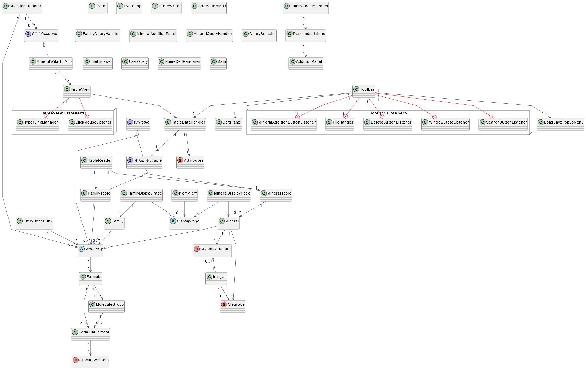
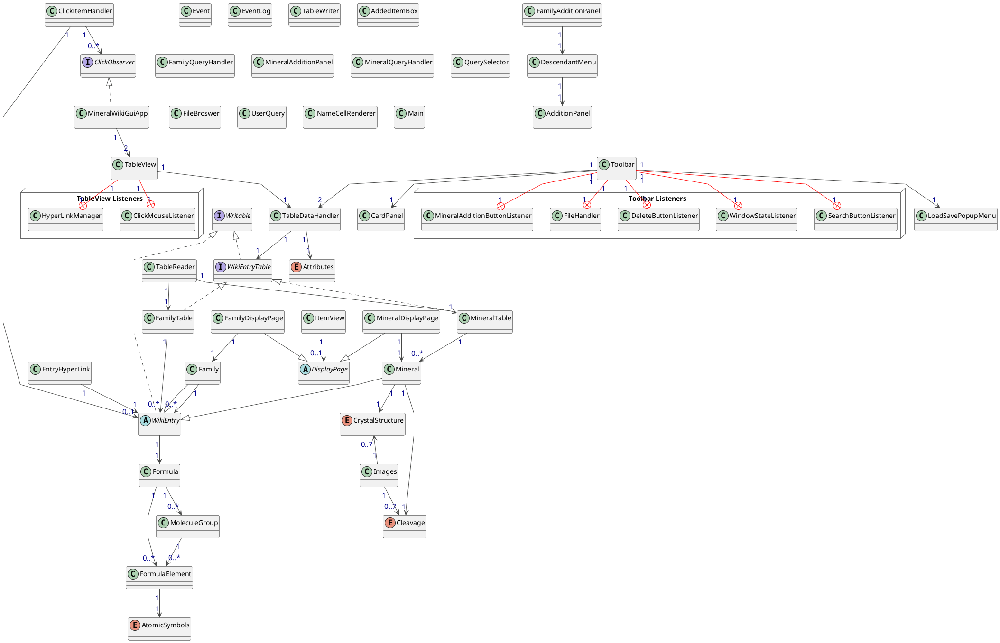

# My Personal Project: Mineral Wiki

## Overview

My personal project will be a mineral database that allows users to view minerals, their
important properties and will allow them to search and filter minerals based on these
properties. 


The program should also provide suggested similar minerals and should provide a way to 
navigate through mineral families. For example the **feldspar** mineral group should refer to entries
of common minerals in the feldspar family. *Finally*, I plan on allowing users to upload images of 
these minerals to these individual entries. 

## Who could use this

This project could be of use to:

1. Collectors of gems and minerals
2. Geology enthusiasts
3. People looking for data or properties of specific materials

I have always been interested in minerals and geology and would find a resource
like this very useful for learning about new minerals. 

## User Stories

1. *As a user*, I would like to view a sortable table of all minerals and their respective properties
2. *As a user*, I would like to add minerals that are not included in the database
3. *As a user*, I would like to be able to search and view minerals by name, chemical composition and other important properties
4. *As a user*, I would like for the ability to add short entries on a mineral's page
5. *As a user*, I would like to view images of these minerals and upload my own 


6. *As a user*, I would like to be prompted to save my current database to a file when I quit the application
7. *As a user*, I would like to be prompted to load a pre-existing mineral database from a save file when I start 
the application [^1]

### Using the Gui
- To add X to Y, click the "Add Item" box specify either a mineral or family and enter the values in
- Note the "Formula" segment must contain a valid chemical formula
- the "table" and "item" page button provide ways to view either all the data or an individual page
- clicking on an item in the table page loads its corresponding item page
- in the item view, wiki entries can be edited/deleted
- clicking on the table headers sorts/groups it by the corresponding property. this works for all quantitative properties
and "crystal structure" and "cleavage"
- The "File" button produces a dropdown that gives options for saving/loading
- If a file has not been saved before, use "Save As" to designate a path or to make a new Save Path

### Phase 4: Task 2 - Sample Logging:
```java
Sun Apr 07 11:34:00 PDT 2024
Mineral: Gold has been modified
Sun Apr 07 11:34:00 PDT 2024
Mineral of name: Gold has been added to the mineral table
Sun Apr 07 11:34:00 PDT 2024
Mineral table has been sorted by: DEFAULT
Sun Apr 07 11:34:22 PDT 2024
Mineral: Silver has been modified
Sun Apr 07 11:34:22 PDT 2024
Mineral of name: Silver has been added to the mineral table
Sun Apr 07 11:34:22 PDT 2024
Mineral table has been sorted by: DEFAULT
Sun Apr 07 11:34:52 PDT 2024
Mineral:  Gold has been accessed
Sun Apr 07 11:34:52 PDT 2024
Mineral:  Silver has been accessed
Sun Apr 07 11:34:52 PDT 2024
Family: Metal has been modified
Sun Apr 07 11:34:52 PDT 2024
Family: Metal has been added to the family table
Sun Apr 07 11:34:53 PDT 2024
Mineral table has been sorted by: IOR
Sun Apr 07 11:34:54 PDT 2024
Mineral table has been sorted by: DENSITY
Sun Apr 07 11:34:55 PDT 2024
Mineral table has been sorted by: HARDNESS
Sun Apr 07 11:35:00 PDT 2024
Mineral table has been sorted by: CRYSTAL
Sun Apr 07 11:35:02 PDT 2024
Mineral table has been sorted by: DEFAULT
Sun Apr 07 11:35:04 PDT 2024
Family: Metal has been accessed
Sun Apr 07 11:35:09 PDT 2024
Mineral:  Silver has been accessed
Sun Apr 07 11:35:09 PDT 2024
Family: Metal has been modified
Sun Apr 07 11:35:16 PDT 2024
Mineral table is being saved
Sun Apr 07 11:35:16 PDT 2024
Family Table is being saved
Sun Apr 07 11:35:18 PDT 2024
Mineral:  Gold has been accessed
Sun Apr 07 11:35:25 PDT 2024
Mineral: Gold has been modified
Sun Apr 07 11:35:25 PDT 2024
Mineral table has been sorted by: DEFAULT
Sun Apr 07 11:35:29 PDT 2024
Family: Metal has been accessed
Sun Apr 07 11:35:34 PDT 2024
Family: Metal has been removed from the family table
Sun Apr 07 11:35:36 PDT 2024
Mineral:  Gold has been accessed
Sun Apr 07 11:35:39 PDT 2024
Mineral of name: Gold has been removed from the mineral table
Sun Apr 07 11:35:39 PDT 2024
Mineral table has been sorted by: DEFAULT
```

### UML Diagram and corresponding code

##### Code for Diagram

---

[^1]: https://github.students.cs.ubc.ca/CPSC210/JsonSerializationDemo/tree/master/src/main/persistence 


